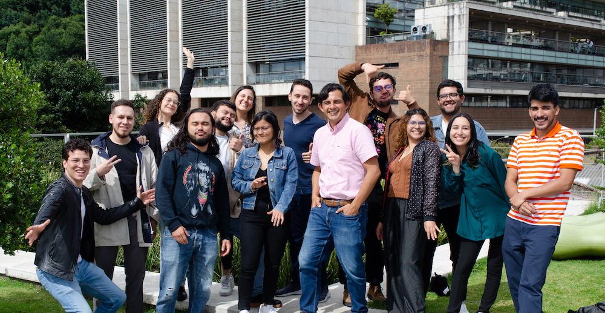

:::{#hero-heading}

Hello, we're a dynamic research group delving into the realm of computational biology, exploring a dozen captivating subjects. From unraveling the intricacies of microbial processes to diving into genomics, population genetics, and systems biology, as well as creating dedicated software for handling vast biological datasets, we cover it all. At the heart of our pursuits are the principles of excellence and scientific rigor, ensuring the delivery of high-quality research.

Within our [team](people.qmd#), we prioritize mutual respect and understanding, valuing the uniqueness that each team member brings to the table. Our diversity is our strength, fostering a collaborative atmosphere characterized by teamwork, fairness, and equity. In summary, we are dedicated to contributing to the scientific exploration of microbial ecology through the use of bioinformatics.

:::

***

::: {.column-body-outset}
{fig-align="center"}
:::

<!-- :::{#hero-heading} -->